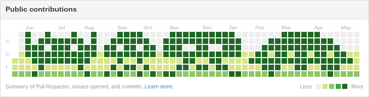

GitHub Pseudo Contributions
===========================

Chrome extension to make your pseudo contributions on GitHub.



Installation
============

Clone it.

```
$ git clone https://github.com/iBenza/github-pseudo-contributions.git
```

Then, add the extension from 'Load unpacked extensions' on `chrome://extensions/`.

Usage
=====

Click a tile of contributions in the top of user's page as paintings tools.
While the shift-key is presses, the contributions are erased.

License
=======

MIT
